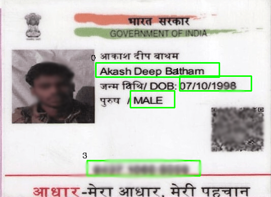
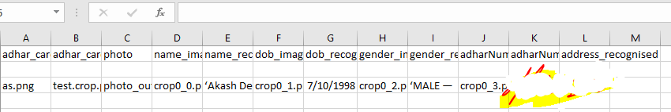

# Adhar-card-reader
This is the OCR which  extract all necessary information form adhar card and pancard. can be used by bank it will save lot of time.

Just run tesseract_text_detection.py 
that will take input from csv file which will be stored in csv/input.csv 
and for the address part you can provide the path of address image in the same csv file 
and that will directly show the output on the console and stored in the csv file.
 
 

